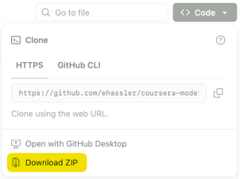

## Modern Statistics: Foundations for Data Interpretation and Decision-Making

The data files and example code are meant to accompany modules 2 and 3 of the Coursera specialization

[https://www.coursera.org/specializations/tbd](https://www.coursera.org/specializations/tbd)

Data files used in presentations and demos are located in the `data` directory, and example code (and additional resources) from demos are located in the `demos` directory.

To download all of these files click on the  near the top of the page and then click the Download ZIP link.

